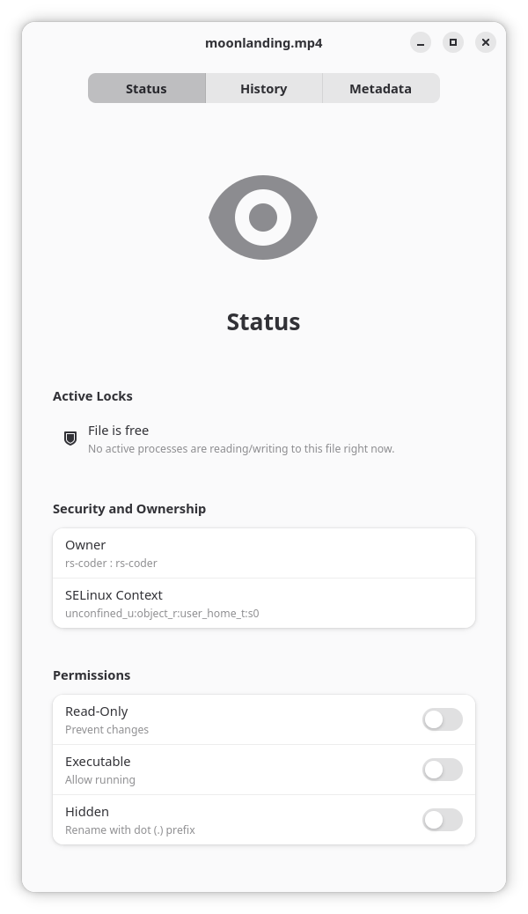
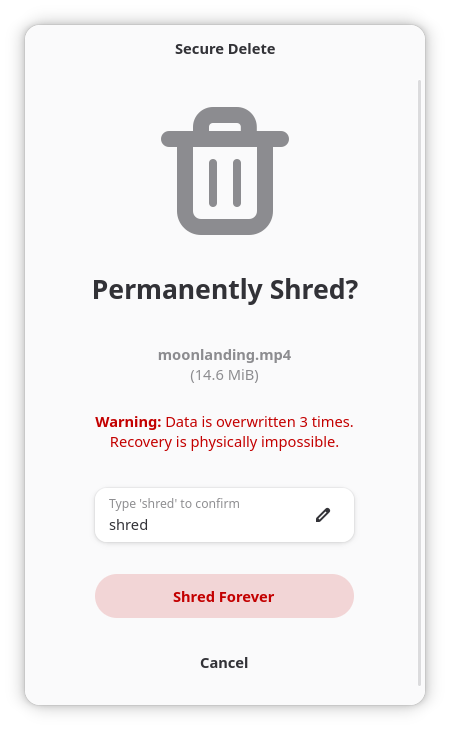
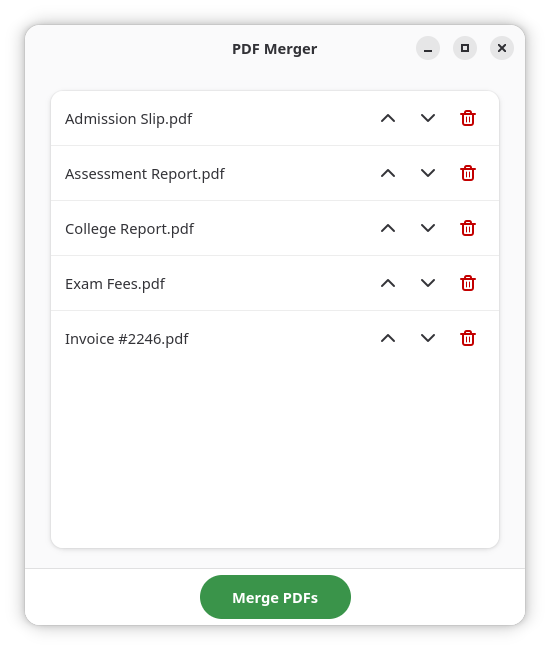
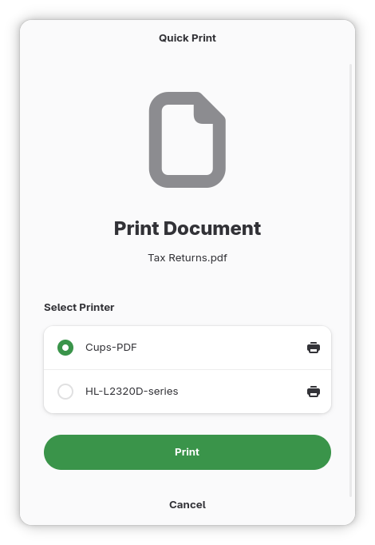
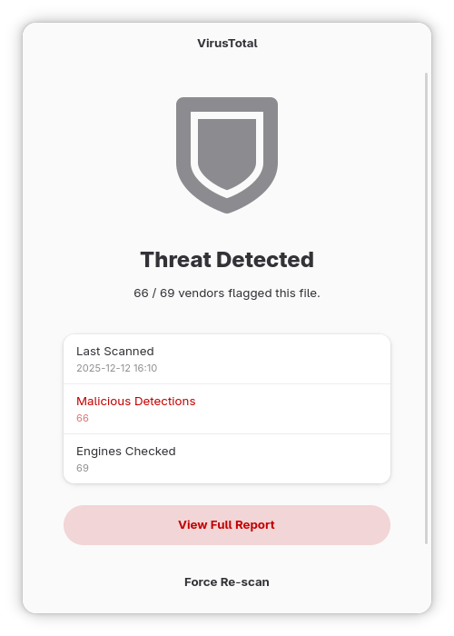
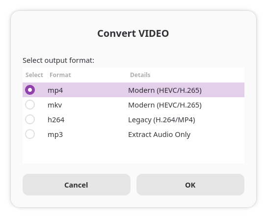
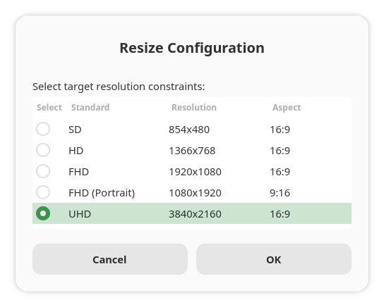
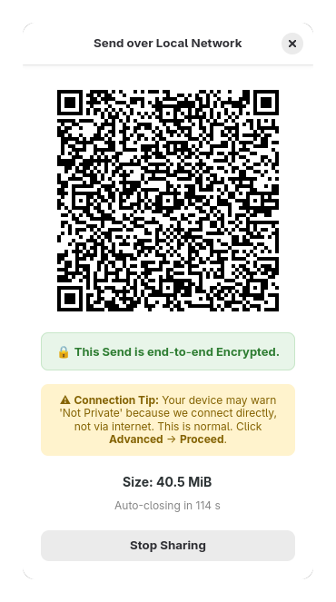

# Power Tools Suite for GNOME

The **Power Tools Suite for GNOME** is designed for people who *want to enjoy Linux every day* without constantly reaching for a terminal window or memorizing obscure commands.This project bridges the gap between the **power of Linux** and the **ease of use** people expect from a modern desktop.

Every tool in the suite is built with clarity, safety, and accessibility in mind. Whether you're exploring file metadata, verifying downloads, or sending files privately over your network, the experience is meant to feel *simple, reassuring, and familiar*, not technical or intimidating.

* * *

# 📚 Table of Contents

* [Why This Suite Exists](#-why-this-suite-exists)
* [Feature Spotlight: Private Local Transfers](#-feature-spotlight-private-local-transfers)
* [Overview of All Tools](#-overview-of-all-tools)
* [Screenshot Gallery](#-screenshot-gallery)
* [Installation](#-installation)
* [Usage](#-usage)
* [Stability & Contributions](#-stability--contributions)

* * *

## 🌟 Why This Suite Exists

Many everyday tasks on Linux like checking what’s inside a file, merging PDFs, resizing images, or securely deleting sensitive documents, are often explained using long terminal commands or cheat sheets.

This suite takes the *strength and flexibility* of Linux and presents it through **friendly, consistent graphical interfaces** so that:

* You can get things done *quickly*
* You don’t need to know command-line flags
* Everything feels like part of your desktop
* Privacy and safety are built in
* You stay in control without needing technical expertise

The goal is simple:**Make GNU/Linux feel welcoming by simplifying the use of the powerful capabilities that make it special.**

* * *

## 🚀 Feature Spotlight: Private Local Transfers

One of the most unique tools in the suite is **Send Over Local Network**, designed for people who want a private, secure way to share files at home, all without cloud accounts, internet access, or apps that track you.

It works by:

* Encrypting the file *before it leaves your computer*
* Creating a sandboxed server on your computer to host the encrypted file
* Exchanging the decryption key through a simple QR code
* Sending the file directly over your local Wi‑Fi network
* Requiring no internet connection whatsoever

This keeps your information entirely within your home and avoids the complexity of SSH, SCP, or other technical setups.

It’s easy, private, and takes only seconds.

* * *

## 🛠️ Overview of All Tools

### **File Centre**

A clear and informative window that shows file details such as metadata, timestamps, ownership, and cryptographic hashes. It helps you understand your files without requiring expertise.

### **Secure Delete**

A safer way to permanently shred sensitive files. The app explains what’s happening and prevents accidental deletions.

### **PDF Merger**

Combine multiple PDFs into one simple sequence. Perfect for receipts, scans, or documents you want to organize.

### **Quick Print**

Send a file straight to your printer without opening it. Ideal for photos, notes, or tickets you just need on paper immediately.

### **VirusTotal Scan**

Check files against dozens of antivirus engines in the cloud using a securely stored API key. Useful for downloaded installers, scripts, and attachments.

### **Integrity Verifier**

Paste a known checksum, choose a file, and instantly know whether it’s legitimate or corrupted; no command-line required.

### **Media Converter**

Convert videos and audio to modern formats with preserved quality. Great for making files compatible with phones, TVs, or editing software.

### **Quick Resize**

Resize images to common resolutions in one click. Helpful for email attachments, uploads, and reducing file sizes.

### **Send Over Local Network**

A secure, private, user‑friendly way to transfer files locally using QR codes.

* * *

## 🖼️ Screenshot Gallery

| Tool | Screenshot |
| --- | --- |
| File Centre |  |
| Secure Delete |  |
| PDF Merger |  |
| Quick Print |  |
| VirusTotal Scan |  |
| Integrity Verifier |  |
| Media Converter |  |
| Quick Resize |  |
| Send Over Local Network |  |

* * *

## 📦 Installation

The suite installs into your user directory, keeping your system clean and avoiding complex setup steps. Before installation, you may need a few common libraries depending on your Linux distribution.

### Fedora

    sudo dnf install python3-gobject python3-libadwaita gtk4 libgexiv2 python3-mutagen python3-secret ffmpeg poppler-utils psmisc attr qrencode ghostscript

### Fedora Silverblue / Kinoite

    rpm-ostree install python3-gobject python3-libadwaita gtk4 libgexiv2 python3-mutagen python3-secret ffmpeg poppler-utils psmisc attr qrencode ghostscript

### Ubuntu / Debian / Linux Mint

    sudo apt install python3-gi python3-adwaita gir1.2-gtk-4.0 gir1.2-adw-1 gir1.2-gexiv2-0.10 python3-mutagen python3-secret ffmpeg poppler-utils psmisc attr qrencode ghostscript

### Arch / Manjaro

    sudo pacman -S python-gobject gtk4 libadwaita libgexiv2 python-mutagen python-secretstorage ffmpeg poppler psmisc attr qrencode ghostscript

* * *

## ▶️ Installing the Suite Itself

    git clone https://github.com/rscoder-s/Power-Tools-Suite-for-GNOME.git
    cd Power-Tools-Suite-for-GNOME
    chmod +x Install
    ./Install

Once installed, GNOME Files (Nautilus) will update automatically.

* * *

## ⌨️ Usage

1. Open **Nautilus**
2. Right‑click a file or folder
3. Open the **Scripts** submenu
4. Select the tool you want to use

Every tool opens its own friendly window that guides you through the task.

* * *

## ⚠️ Stability & Contributions

The suite is currently in **alpha**, which means:

* You may run into small issues
* Features may evolve
* Feedback is incredibly valuable

If you want Linux to be more welcoming for everyday users, this project is a great place to contribute. Whether through code, testing, design suggestions, or translations.

* * *
